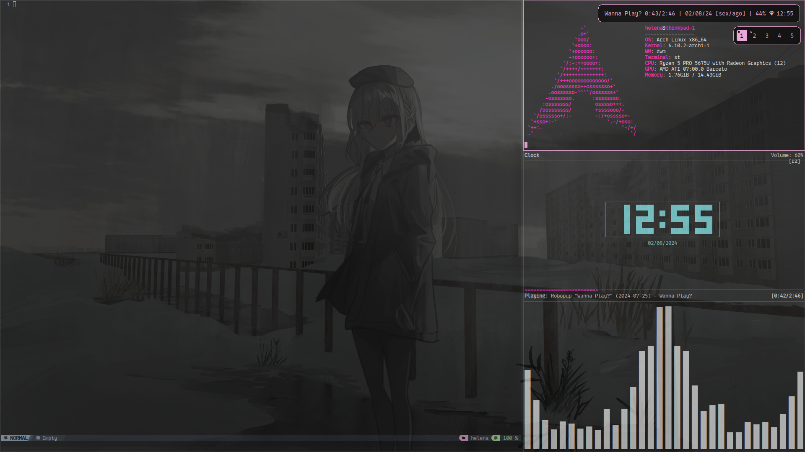

# My Desktop 

`user` folder is equivalent to ~  

Basic stuff:

- Window manager: Dwm
- - The bar is out of the way, it shows up when mod is pressed
- Terminal: St
- App launcher: dmenu
- Compositor: picom

## Requirements in my .xinitrc
- Screen Temperature: redshift (my eyes hate blue)
- Brightness: light (my eyes hate bright)
- Wallpaper: xwallpaper
- Keybinds: xbindkeys

## Keybinds

Default dwm keybinds  
  
From .xbindkeysrc:  
Ctrl + Shift + t = St  
Ctrl + Shift + return = Dmenu (specifically dmenu_run)  
Ctrl + Shift + s = Power settings  
Ctrl + Shift + w = Wallpaper theme selector  
Ctrl + Shift + v = Paste using xvkb  

## Wallpapers

Though not here, i have a folder in ~ called `Backgrounds`. In it, there are folders named with an id (such as A) which contains a set of images for the wallpaper rotation. The wallpaper theme selector ( Ctrl + Shift + w ) allows you to pick one.   
The themes must be manually set in `~/Scripts/wallBind.sh`  
Wallpaper rotates every 300 seconds.

## Scripts

The scripts have comments at the top saying what they do.  
